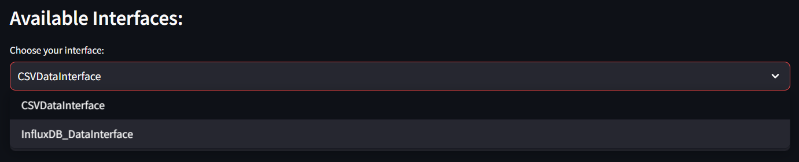
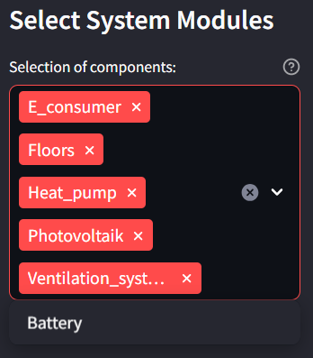
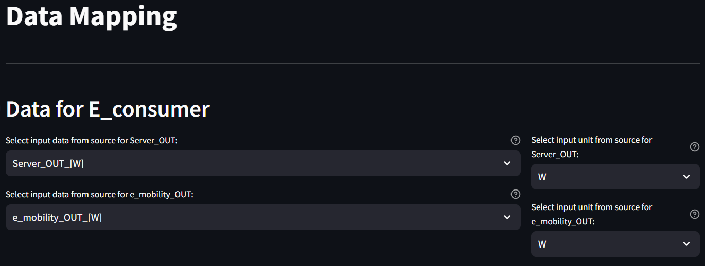
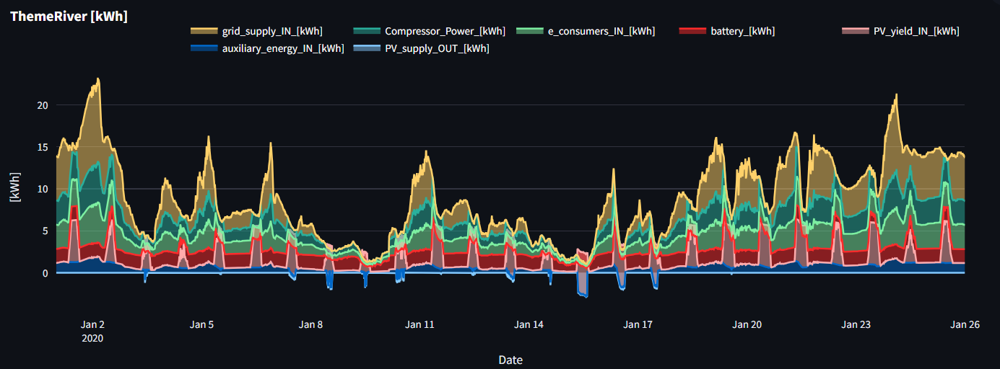

# Energy Monitor

[](https://energy-monitor.readthedocs.io/en/latest/?badge=latest)

[

## Overview

The Energy Monitor is a comprehensive software solution for analyzing and visualizing energy flows and data. Developed in Python using Streamlit, it allows users to select different system modules, map data, and perform energy analyses.

## Structure

The project follows a modular architecture, subdivided into:

- **`Main.py` (Script for initialization and setting configurations - Streamlit UI)**
- **`Configuration.json` (JSON for storing settings)**

- **/pages**
    - **`analysis_layer.py` (Script for individual data analysis of historical data - Streamlit UI)**
    - **`presentation_display.py` (Script for automatic visualization of current data - Streamlit UI)**
        - **/modules**
            - **`Heat_pump_module.py` (System component for measuring data of the heat pump)**
            - **`Photovoltaik_module.py` (System component for measuring data of the PV)**
            - **`Battery_module.py` (System component for measuring data of the battery)**
            - **`E_consumer_module.py` (System component for measuring data of the electricity consumers)**
            - **`Floors_module.py` (System component for measuring data of the floors)**
            - **`Ventilation_system_and_heating_pumps_module.py` (System component for measuring data of the ventilation system)**

- **/functions**
    - **`api.py` (Interface to the database)**
    - **`compute_energy.py` (Conversion between power and energy)**
    - **`imputation.py` (Statistical computation)**
    - **`sankey.py` (Creation of Sankey diagrams)**
    - **`conversion.py` (Unit conversion)**

## Main Features

- **Data Access**: Support for CSV files.
- **Modular Analysis**: Various modules for specific techniques like heat pumps, PV modules, etc.
- **Visualization**: Displays energy flows and technology-specific metrics.
- **Analysis Layer**: Enables historical analyses with interactive Plotly charts.

## Current Status

The project is in an advanced stage of development with a clear structure and defined functions. The user interface, modules, and data access layers are implemented. Further improvements and expansions are planned.

## Next Steps

- **Expand Modules**: Additional analysis and visualization functions.
- **Integration of Additional Data Sources**: Support for more databases or APIs.
- **User Interface and UX Optimization**: The possibility of adding calculated data sets via the UI. Make system modules integrable via the UI.
- **Testing and Validation**: Implementing quality assurance tests.
- **Documentation and Training**: Creating comprehensive documentation.
- **Warning Systems**:Integration of a warning system for key figures
- **Revised calculation methods**: Calculation of weeks and months in analyselayer with dynamic frequencies
- **Revise data mapping**: Implement the possibility for calculated datasets in the analyselayer.

## Installation Guide 

### MacOS

1. Ensure that Python, pip and git are installed on your machine.
2. Open the Terminal.
3. Execute the command:
    ```bash
    pip install virtualenv
    ```
4. Create a virtual environment with:
    ```bash
    virtualenv venv
    ```
5. Activate the virtual environment using:
    ```bash
    source venv/bin/activate
    ```
6. Clone the repository using:
    ```bash
    git clone https://github.com/Welian95/Energy_Monitor
    ```
    (If git is not installed, download the repository from GitHub into your desired folder).
7. Navigate to the project directory:
    ```bash
    cd Energy_Monitor
    ```
8. Install the required packages using:
    ```bash
    pip install -r requirements.txt
    ```
9. Run the program using:
    ```bash
    python Main.py
    ```
10. Launch the Streamlit interface with:
    ```bash
    streamlit run Main.py
    ```

### Linux

1. Ensure that Python, pip and git are installed on your machine.
   (Or Install with:
   ```bash
   sudo apt install python3-pip python3-full git
   ```)
2. Open the Terminal.
3. Execute the command:
    ```bash
    sudo apt install python3-venv
    ```
4. Create a virtual environment with:
    ```bash
    python3 -m venv energymonitor
    ```
5. Activate the virtual environment using:
    ```bash
    source energymonitor/bin/activate
    ```
6. Clone the repository using:
    ```bash
    git clone https://github.com/Welian95/Energy_Monitor
    ```
    (If git is not installed, download the repository from GitHub into your desired folder).
7. Navigate to the project directory:
    ```bash
    cd Energy_Monitor
    ```
8. Install the required packages using:
    ```bash
    pip install -r requirements.txt
    ```
9. Run the program using:
    ```bash
    python3 Main.py
    ```
10. Launch the Streamlit interface with:
    ```bash
    streamlit run Main.py
    ```

### Windows

1. Ensure that Python, pip, conda and git are installed on your machine.
2. Make sure you use conda to [Install Streamlit on Windows](docs.streamlit.io/library/get-started/installation#install-streamlit-on-windows)
3. Open the Terminal.
4. Create a virtual environment with:
    ```bash
    conda create --name energymonitor python=3.9
    ```
5. Activate the virtual environment using:
    ```bash
    sconda activate energymonitor
    ```
6. Clone the repository using:
    ```bash
    git clone https://github.com/Welian95/Energy_Monitor
    ```
    (If git is not installed, download the repository from GitHub into your desired folder).
7. Navigate to the project directory:
    ```bash
    cd Energy_Monitor
    ```
8. Install the required packages using:
    ```bash
    pip install -r requirements.txt
    ```
9. Run the program using:
    ```bash
    python Main.py
    ```
10. Launch the Streamlit interface with:
    ```bash
    streamlit run Main.py
    ```

Note that the installation can vary for different operating systems.

## Usage

1. After you have connected your database to the datamapping via an interface, you can start the Main.py. 

2. Select your interface. 




3. Select your System Modules. (Currently only modules for the sample dataset are available, if you want to add new modules you can do so.)




4. After the module selection you can start the data mapping. Select a measurement series from your database for each measurement point required by the selected modules. 




5. After correct assignment, you can view the energy balance of your system in the presentation dsiplay. The key figures of the technology modules are also displayed here.


6. In the analysis layer, you can now visually display historical data from your database. You have a choice of 5 diagram types, such as a Theme River. You can also convert your data or adjust the time frequency. A detailed explanation will follow shortly.




   

## Data Access API Documentation

#### Overview

The Data Access API is designed to provide a consistent interface for accessing different data sources. Currently, there is an implementation for accessing CSV files, but the API is extensible and can be adapted for other data sources like SQL databases, InfluxDB, APIs, etc.

#### Main Components

- **`get_column_names()`**: Returns the names of the columns.
- **`get_time_frequency()`**: Returns the time frequency of the measurement data.
- **`get_data()`**: Reads and filters the data based on various parameters. It allows multi-dimensional filtering based on columns, rows (both forward and backward), and timestamps.
- **`get_first_timestamp()`**: Returns the first timestamp in the data.
- **`get_last_timestamp()`**: Returns the last timestamp in the data.
      
Each interface must have these components with the same outputs and functions. 
The **Abstract Base Class** Defines the basic methods that must be provided by concrete implementations.


#### Creating a New Concrete Class

To create a new concrete class that, for example, works on an SQL or InfluxDB database, you need to implement the abstract methods from the **`DataInterface`** class.

#### Note
Make sure the get_data() method supports similar filter parameters as the CSVDataInterface class to maintain consistency.
Ensure that timestamps are returned as pd.Timestamp objects to maintain consistency with other implementations.

For more detailed documentation, please visit our [](https://energy-monitor.readthedocs.io/en/latest/?badge=latest)

## License

Considering this is a project for a scientific thesis and relies on open-source modules, the project is under [MIT License](https://opensource.org/licenses/MIT). It allows for free use, modification, and distribution, with an acknowledgment of the original creation.

## Contact

For any questions or suggestions, please contact via GitHub or email at [westerhorstmann@bode.ms](mailto:westerhorstmann@bode.ms).
